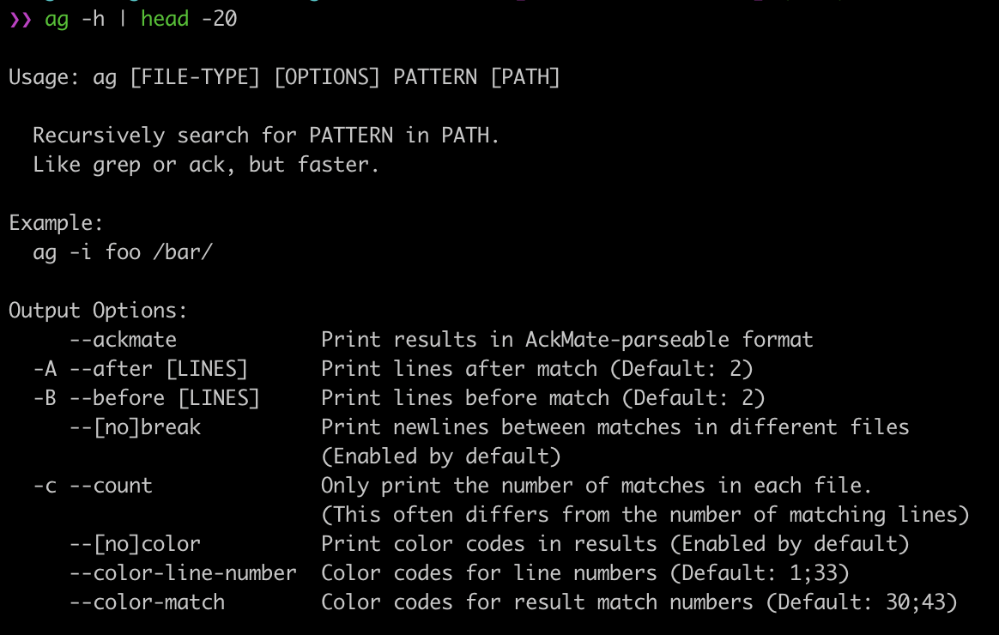
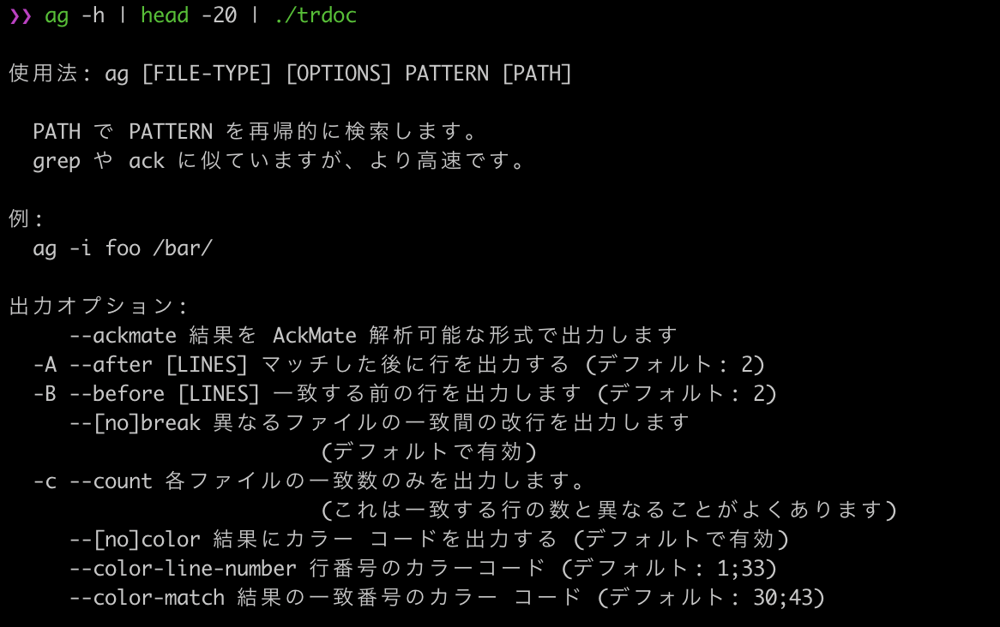
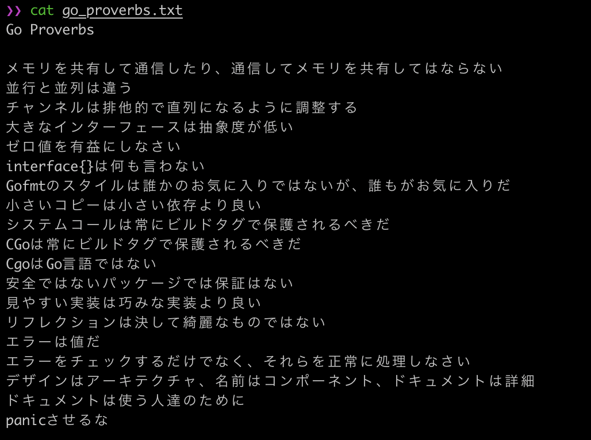
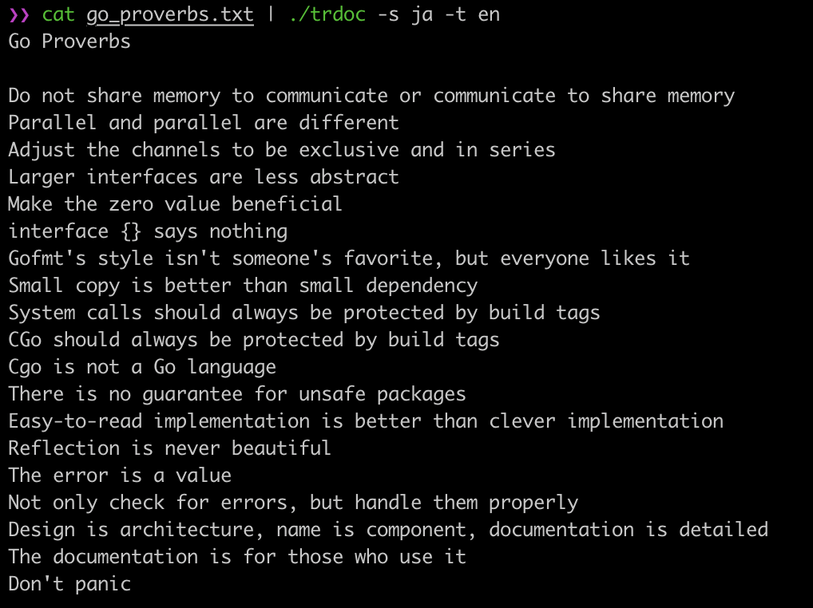

# trdoc

translater

## Usage
```bash
Usage of trdoc:
  -s string
    	source language. ex. en, ja ...
  -t string
    	target language. ex. ja, en ...
  -version
    	Print version information and quit.
```

## ex.

Language | Source                   | Target
:-------:|:------------------------:|:-------------------------:
En ⇨ Ja  |  | 
Ja ⇨ En  |  | 
