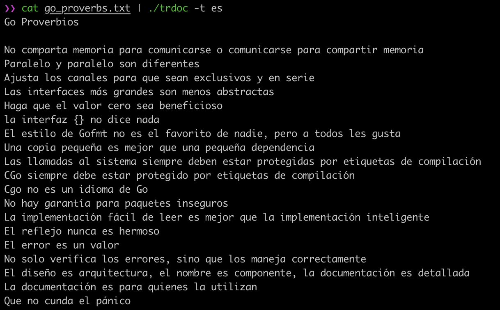

# trdoc

translater

[Language List](https://cloud.google.com/translate/docs/languages)


## Usage
```bash
Usage of trdoc:
  -s string
    	source language. ex. en, ja ...
  -t string
    	target language. ex. ja, en ...
  -version
    	Print version information and quit.
```

Language | Source                   | Target
:-------:|:------------------------:|:-------------------------:
En ⇨ Ja  |  | 
Ja ⇨ En  |  | 


## other ex.

Language | Target
:-------:|:------------------------:
⇨ zh     | 
⇨ hi     | 
⇨ es     | 
⇨ ar     | 
⇨ bn     | 
⇨ pt     | 
⇨ ru     | 
⇨ fr     | 
